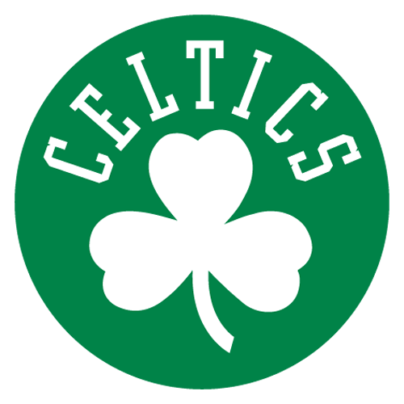
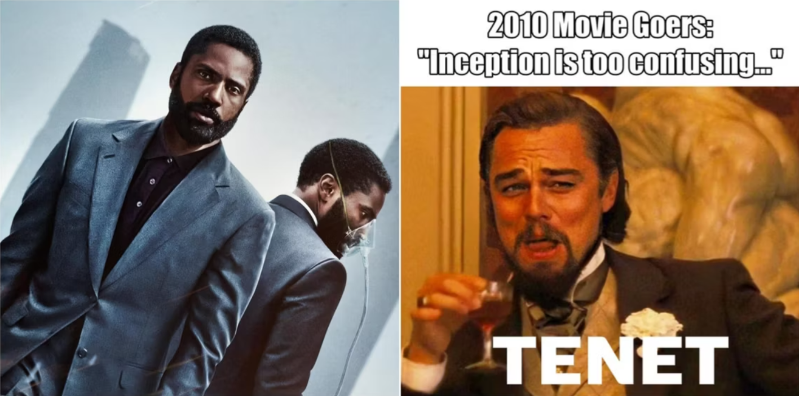
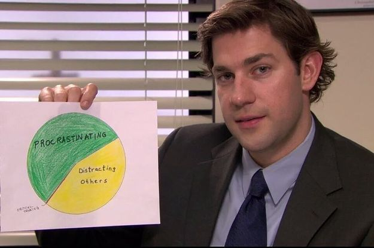

## My Stats Blog
This is my blog to respond to prompts for my class ST558: Data Science for Statisticians. I am taking this class as part of NC State Univerisity's graduate certificate program for Applied Statistics and Data Managment.

## Interests
Here are a few things that I am interested in (unrelated to statistics):

* Professional Sports  
    + Basketball  
    + Football  

   
* Movies
    + Quentin Tarantino  
    + Christopher Nolan  
  

   
* TV  
    + The Office  
    + Breaking Bad  
  
  
 
